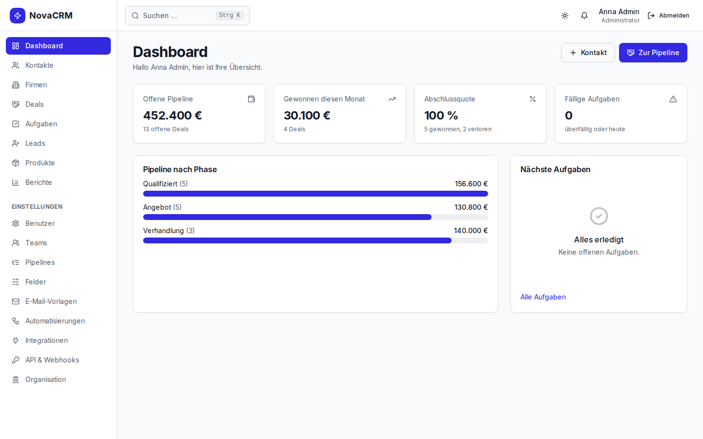

# OneCommand

**by [USC Software UG](https://usc-software-ug.de)**

Build complete, production-ready software systems from a single prompt.

One command. Eight phases. Working software.

<p align="center">
  
</p>
<p align="center"><sub>NovaCRM — built from the four-word prompt <code>"CRM auf höchstem Niveau"</code> in 50 minutes.
<a href="docs/showcase/crm/README.md">All screenshots →</a></sub></p>

---

## Install

```bash
git clone https://github.com/rqd6f4g6zn-bit/OneCommand.git ~/OneCommand
cd ~/OneCommand
./install.sh            # add --dry-run to preview, --verbose for per-file output
```

The installer is idempotent and syncs by content: after `git pull`, re-run it and every changed
file reaches Claude Code and Codex — unchanged files are skipped. It needs `python3` and `rsync`.

Then restart Claude Code and run `/oc-doctor` to confirm the installation is healthy.

### Updates

OneCommand updates itself. At the start of every Claude Code session (at most every 6 hours) it
checks the tracked branch of your checkout; when a newer release exists it fast-forwards, re-runs
`install.sh`, and rolls back automatically if that install fails. It never updates while a build is
in progress, when the checkout has local changes, or when you are on another branch.

- `/oc-update` — update now · `/oc-update check` — only look · `/oc-update off|on` — toggle
- Settings in `~/.onecommand/config.json`: `auto_update`, `update_branch`, `update_interval_hours`

## Usage

```bash
/onecommand "fitness app with login, workout tracking, and leaderboard"
/onecommand "SaaS dashboard with Stripe payments, team management, and analytics"
/onecommand "e-commerce store with product catalog, cart, checkout, and admin panel"
/onecommand "security monitoring system with alerting, logs, and user management"
/onecommand "real estate platform with listings, search, favorites, and agent portal"
```

## What Gets Built

OneCommand runs 8 phases automatically:

| Phase | What happens |
|-------|-------------|
| 1. Spec | Analyzes your prompt → structured project spec |
| 2. Frontend + Backend | Parallel generation: full UI + API + DB + auth |
| 3. Integration + Marketing | Connect systems, generate README + landing page |
| 4. Quality Gate + Acceptance | Build, lint, types, unit tests — then every acceptance criterion from the spec as a Playwright test against the running app; self-healing until green |
| 5. Automations | Git hooks, GitHub Actions CI/CD, Makefile |
| 6. Exceed Expectations | Dark mode, PWA, accessibility, security audit — then a final regression gate |
| 7. Self-Improvement | Learn from this run for better future builds |
| 8. Delivery | Complete report + deploy instructions |

The whole run needs no manual steps: every phase runs in its own subagent, so the build never
pauses for `/clear`. State is checkpointed to disk after each phase — if anything interrupts the
build, `/oc-resume` continues where it stopped.

## Definition of Done

Phase 1 writes **acceptance criteria** into `.onecommand-spec.json` — concrete, observable results per
feature ("after login, /dashboard shows heading 'Dashboard'", "GET /api/workouts without a session
returns 401"). Phase 4 turns each one into a Playwright test and runs it against the production
build with a real database. A build is only reported as complete when every `must` criterion
passes; otherwise the delivery report says **NOT VERIFIED** and lists what is open.

The verdict comes from `hooks/quality-gate.sh`, not from an agent's judgement:

```bash
bash hooks/quality-gate.sh --stage all --project-dir ~/Desktop/MyApp   # static → e2e → tour
# → .onecommand/gate/result.json, errors.txt, acceptance.md · .onecommand/tour/*.png, review.md
```

## Looks at What It Built

Green tests are not enough. A real CRM build passed all 43 acceptance tests and still showed
"Abschlussquote 100 %" above "5 gewonnen, 2 verloren" — the screenshots revealed it, no test did.
So every build now ends with what a reviewer does:

- **API contract** — the spec defines every endpoint's request and response; `hooks/api-contract.py`
  generates one TypeScript file that frontend (Claude) and backend (Codex) both import. The gate fails
  on edited types, missing routes and untyped handlers, and warns where code guesses field names.
- **Metrics with one definition** — every KPI has a definition, a period and a label in the spec; one
  server function computes it, every page shows the same label.
- **UI tour** — `quality-gate.sh --stage tour` loads the full demo data, starts the production build
  with fresh secrets, logs in with one demo account per role and screenshots every page on desktop and
  mobile. Server errors, lost sessions, "undefined"/"NaN" on screen, missing metric labels and mobile
  overflow are found automatically; the test agent then reviews every screenshot from a checklist
  until nothing is open. The screenshots go into the delivery report.

See [the CRM showcase](docs/showcase/crm/README.md) for the screenshots and what they revealed.

## Knows the Domain

Short prompts are enough for common business systems. OneCommand ships domain blueprints for
**CRM, online shop, appointment booking, helpdesk, project management and invoicing** — what a
professional expects from each, as modules with concrete acceptance criteria:

| Prompt says | Tier | Example: CRM |
|---|---|---|
| "MVP", "erste Version", "einfaches CRM" | mvp | 7 modules · 21 criteria · 4 metrics |
| nothing about scope | pro | 16 modules · 39 criteria · 5 metrics (roles, leads, import, reports, e-mail, GDPR …) |
| "höchstes Niveau", "Enterprise", "wie Salesforce" | enterprise | 22 modules · 47 criteria · 6 metrics (+ automations, API, SSO, multi-tenancy …) |

```bash
/onecommand "CRM auf höchstem Niveau"
```

Anything you add to the prompt is built on top; modules you explicitly don't want are left out and
noted in the delivery report.

## Uses Every Skill You Have

Phase 1 builds a skill plan from **all** available skills — OneCommand's bundled ones and every
skill you installed yourself (`~/.claude/skills`, project `.claude/skills`, other enabled plugins
such as superpowers or marketing-skills). Each external skill gets an explicit decision: which phase
uses it and for what, or why it does not fit this project. Every phase's agents receive the skills
assigned to them. The plan is saved to `.onecommand/skill-plan.md` in the project.

## Benchmark

`bench/run.py` measures OneCommand itself: it builds fixed prompts headless and scores each build
from the gate verdict, the acceptance ratio and the completed phases (0–100), plus time and cost.

```bash
python3 bench/run.py run --set core --skip-permissions   # 3 web apps, ~2-3 h, sandbox/VM only
python3 bench/run.py compare bench/baselines/v1.5.0.json bench/results/<run-id>/results.json
```

Run it before and after changing a skill or agent — a lower score is a regression.

Headless builds (`claude -p '/onecommand:onecommand "…"'`) should set
`CLAUDE_CODE_PRINT_BG_WAIT_CEILING_MS=0`: Claude Code can run parallel phase agents in the background,
and without it the CLI stops waiting after 600 s. `bench/run.py` sets it.

| Benchmark build | Prompt | Score | Acceptance | Time |
|---|---|---|---|---|
| Notes app (v1.5.0) | 2 sentences | 100 | 18/18 | 50 min |
| CRM enterprise (v1.6.0) | "CRM auf höchstem Niveau" | 100 | 43/43 | 50 min |

## Output

- **Full frontend** (Next.js + Tailwind + shadcn/ui) — all pages, components, mobile responsive
- **Complete backend** (API routes, auth, DB schema, migrations, seed data)
- **Acceptance suite** (`e2e/acceptance/`, one Playwright test per criterion, runnable with `npx playwright test`)
- **Automation** (Git hooks, GitHub Actions, Makefile)
- **Documentation** (README, CHANGELOG, landing page)
- **Security** (OWASP audit, rate limiting, input validation)
- **Extras** (dark mode, PWA, error boundaries, loading skeletons, accessibility)

## Commands

| Command | Description |
|---------|-------------|
| `/onecommand "<prompt>"` | Build a complete software system |
| `/onecommand-status` | Show current build phase progress |
| `/oc-save` | Save build state so `/clear` is safe at any moment |
| `/oc-resume` | Continue an interrupted build from the last phase |
| `/oc-doctor` | Diagnose the installation and print exact fixes |
| `/oc-update` | Install the latest OneCommand now (also happens automatically) |

Builds are written to `~/Desktop/<ProjectName>` — never into the plugin folder. If the current
directory already contains a OneCommand spec, that directory is used instead (resume case).

## Requirements

- **Claude Code** with this plugin installed
- **Node.js 20+**
- **python3** and **rsync** (for `install.sh`)
- **Codex CLI** for backend generation: `/codex:setup` (recommended, not required)
- **Required plugins**: `superpowers`, `marketing-skills`
- **Optional**: PostgreSQL (for local DB-backed apps), Docker

## Self-Improvement

Every run stores learned patterns in `~/.onecommand/memory/`. Over time, OneCommand makes better stack decisions and produces fewer errors on the first attempt.

---

<p align="center">
  <b>OneCommand</b> — built by <a href="https://usc-software-ug.de"><b>USC Software UG</b></a><br>
  <sub>Copyright © 2026 USC Software UG · Alle Rechte vorbehalten · All rights reserved</sub>
</p>
