# Showcase: NovaCRM — gebaut aus „CRM auf höchstem Niveau“

Ein einziger Prompt mit vier Wörtern:

```
/onecommand:onecommand "CRM auf höchstem Niveau"
```

OneCommand erkannte den Blueprint `crm` (Stufe `enterprise`) und baute daraus NovaCRM. Der Lauf dauerte 50 Minuten
und ist im Benchmark `bench/baselines/v1.6.0-crm-enterprise.json` festgehalten.

| | |
|---|---|
| Stack | Next.js 16, React 19, Prisma, SQLite (Postgres-fähig), Tailwind |
| Umfang | 25 Seiten, 65 API-Routen, 26 Datenmodelle, ~7.500 Zeilen Code |
| Abnahme | 43/43 Akzeptanzkriterien als Playwright-Tests grün, Quality Gate grün (inkl. Regressionslauf) |
| Sicherheit | Security-Audit im Build: Standard-JWT-Secret, SSRF, Mandantentrennung und Open Redirect wurden gefunden und behoben |

Die Screenshots zeigen die Produktionsversion mit den Demo-Daten aus `npm run db:seed`, angemeldet als
`admin@novacrm.demo`. Die Seiten wurden nicht nachbearbeitet.

## Desktop

### Anmeldung
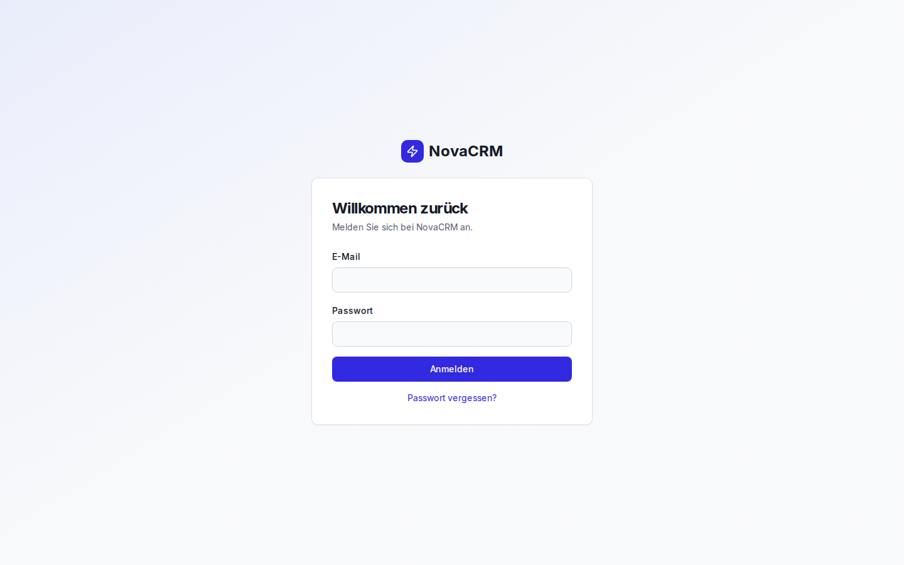

### Dashboard


### Kontakte: Suche, Filter, Tags, CSV-Import/-Export
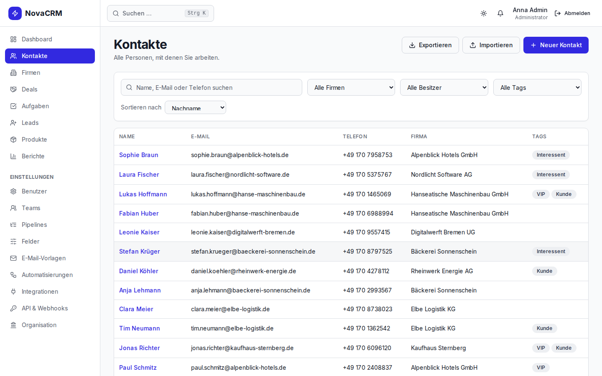

### Kontakt-Detail: Timeline, E-Mail, DSGVO-Export und -Löschung
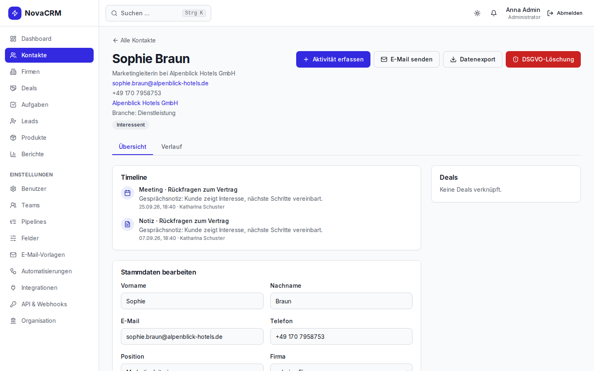

### Deals als Kanban-Pipeline (Drag & Drop, mehrere Pipelines)
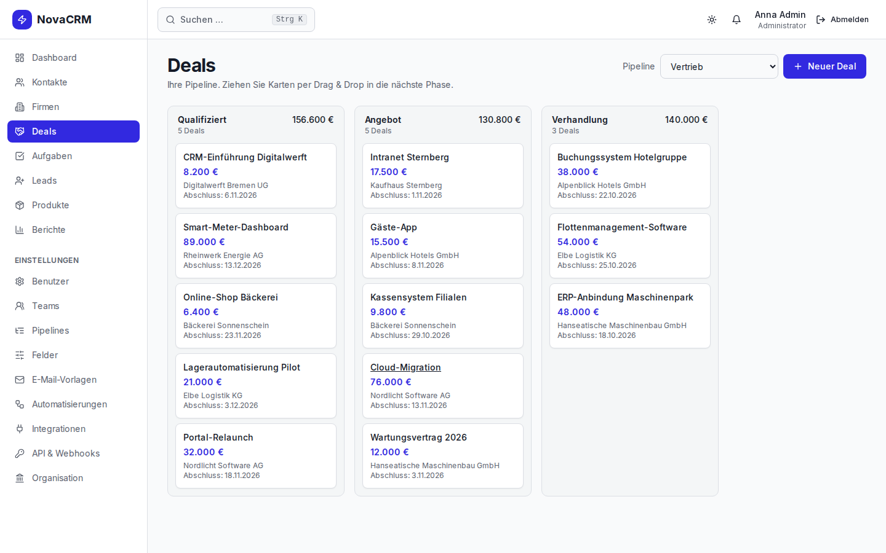

### Deal-Detail
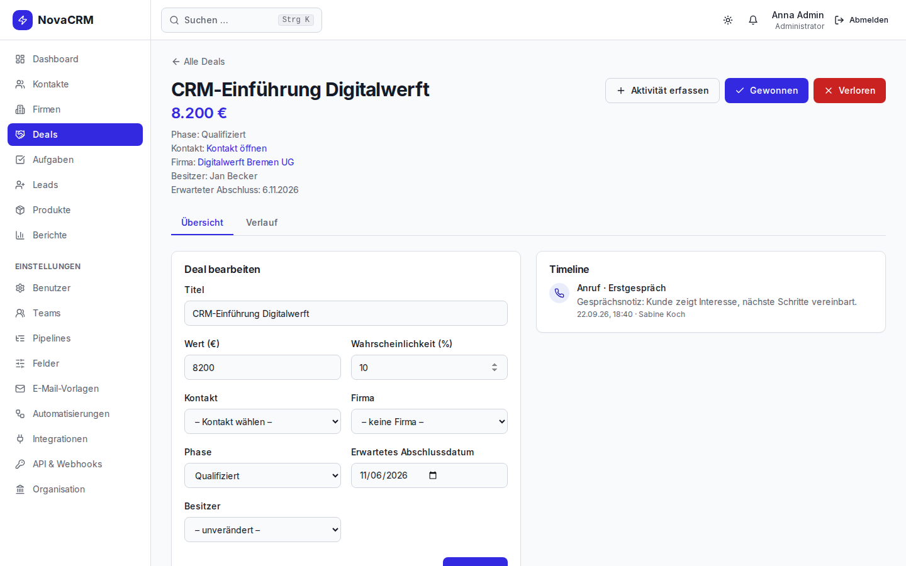

### Firmen
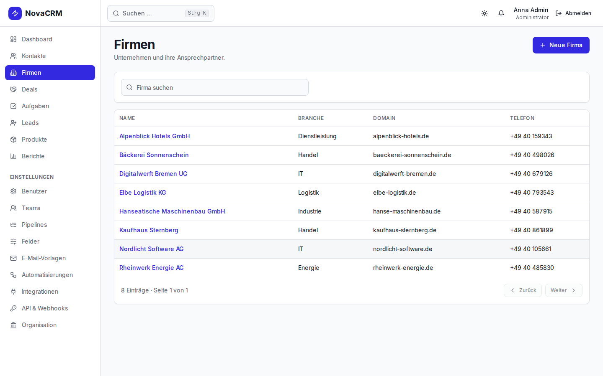

### Leads
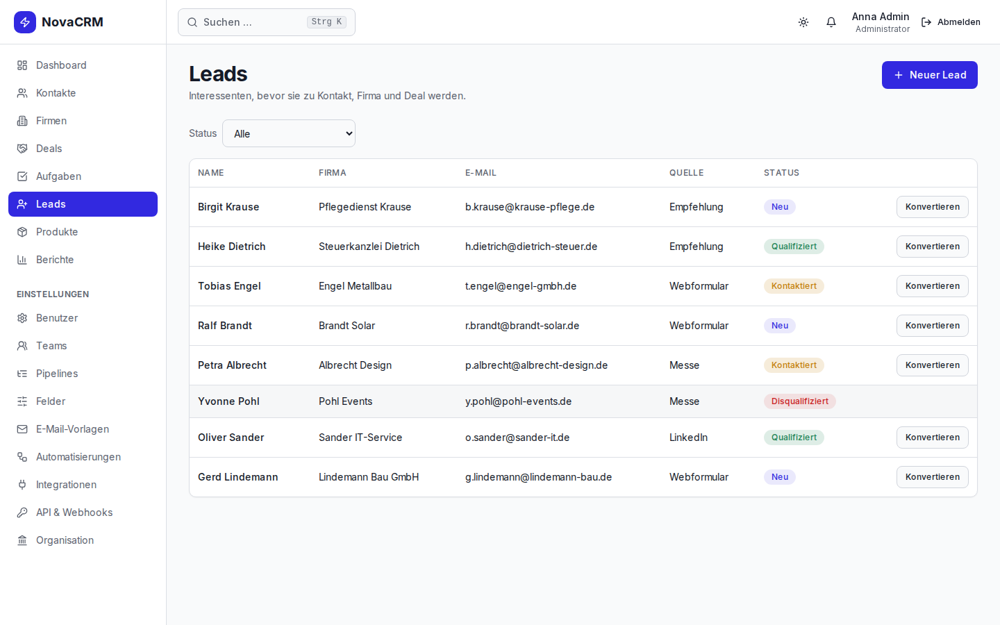

### Aufgaben
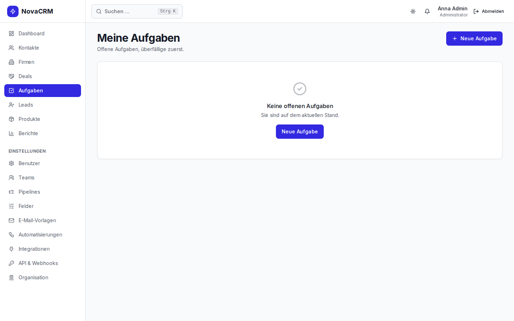

### Berichte: Abschlussquote pro Mitarbeiter, gewichtete Prognose, Quotenerreichung
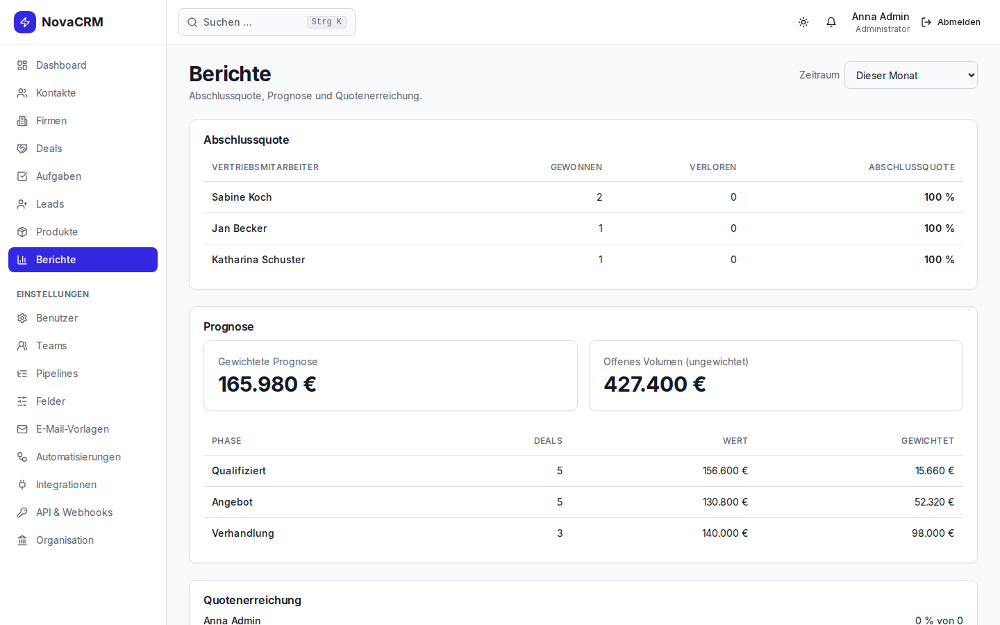

### Automatisierungen mit Ausführungsprotokoll
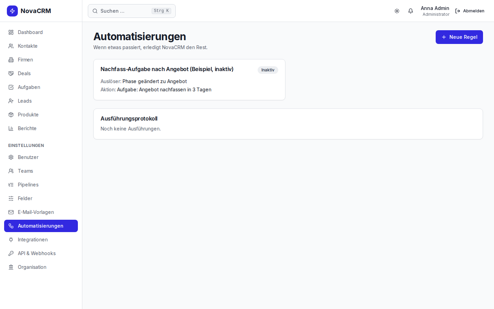

### Pipelines und Phasen konfigurieren
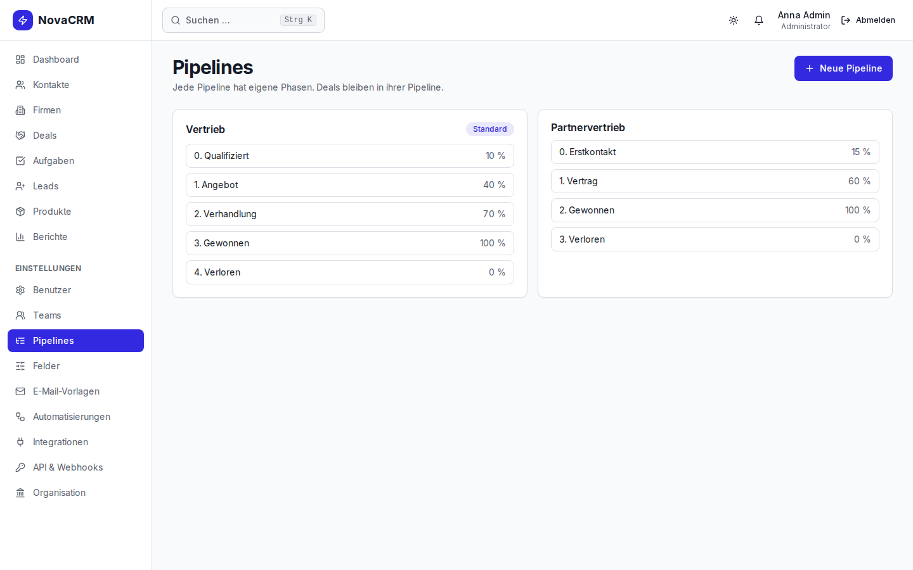

## Mobil (390 px)

<p>
  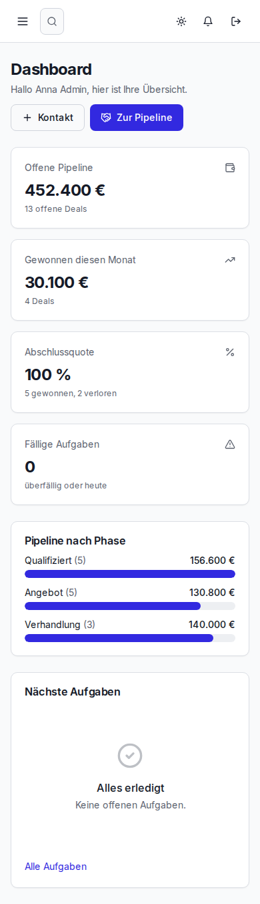
  &nbsp;
  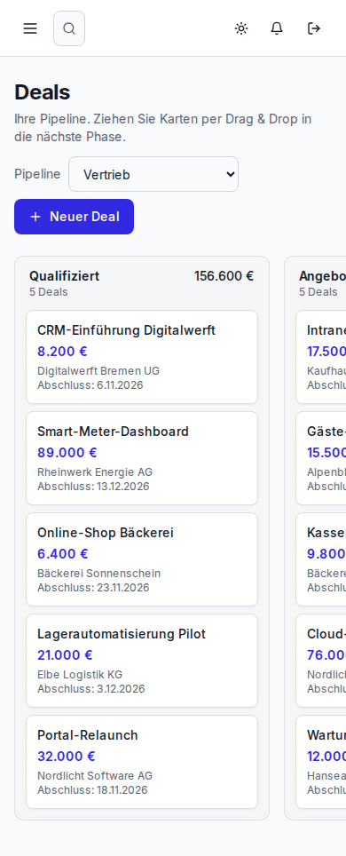
</p>

## Was die Screenshots gezeigt haben und was OneCommand jetzt selbst prüft

Alle Tests waren grün. Beim Durchsehen der Screenshots fielen trotzdem Fehler auf, die kein Test erfasst hat.
Seit v1.7.0 findet OneCommand diese Fehlerklassen in jedem Build selbst.

| Gefunden im Screenshot | Ursache | Neu in OneCommand v1.7.0 |
|---|---|---|
| Dashboard: „Abschlussquote 100 %“ über „5 gewonnen, 2 verloren“ | Die Quote zählt nur diesen Monat, die Anzahlen zählen alle Deals | `metrics` in der Spec: Definition, Zeitraum und Label pro Kennzahl. Der UI-Rundgang prüft die Labels, ein Akzeptanzkriterium prüft Dashboard = Berichte |
| Offene Pipeline: 452.400 € auf dem Dashboard, 427.400 € in den Berichten | Frontend und Backend wurden parallel gebaut, das Frontend rät die Feldnamen der API (`pick(dash, ["winRate", "closeRate", …])`) | API-Vertrag (`hooks/api-contract.py`): generierte TypeScript-Typen für beide Seiten. Der Quality Gate prüft Routen, Typnutzung und geratene Feldnamen |
| „Meine Aufgaben“ für den Admin-Demo-Login leer | Die Demo-Daten geben nur den Vertriebsmitarbeitern Aufgaben | `demo` in der Spec: ein Demo-Login pro Rolle, der Demo-Seed füllt jede Ansicht |
| Produktionsstart verweigert den Login mit dem Dev-Secret aus `.env` | Gewollt (Sicherheitsfix), aber bis dahin nie unter Produktionsbedingungen geprüft | Gate-Stage `tour`: startet den Produktions-Build mit frischen Secrets, meldet sich mit jedem Demo-Login an, fotografiert jede Seite (Desktop + Mobil) und legt eine Review-Checkliste an |
| `/settings/integrations` auf dem Handy 212 px zu breit | Tabelle ohne horizontales Scrollen | Der Rundgang misst horizontalen Überlauf auf jeder Seite |
