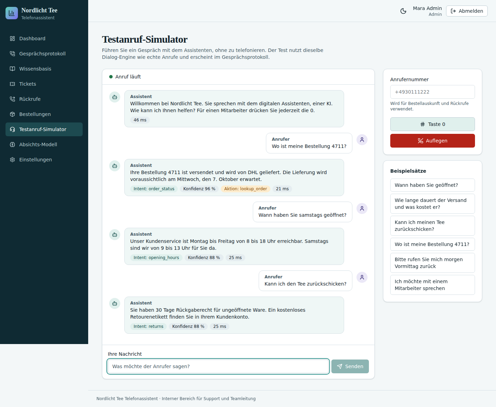
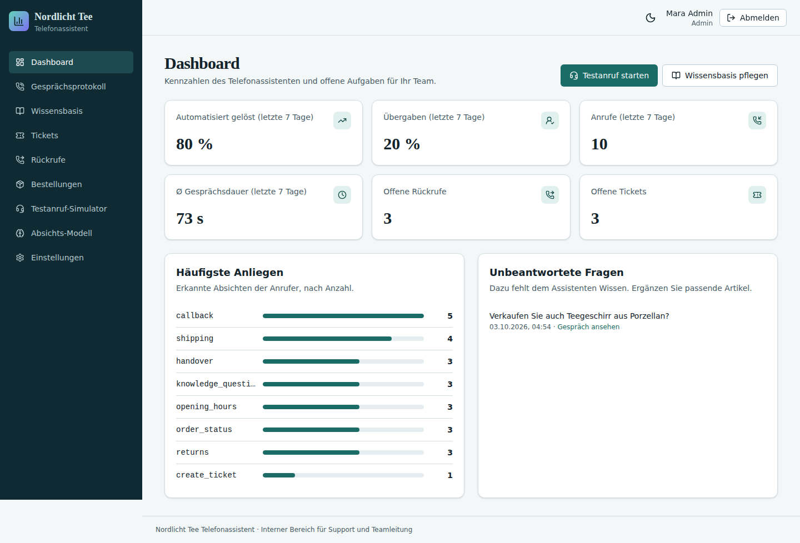
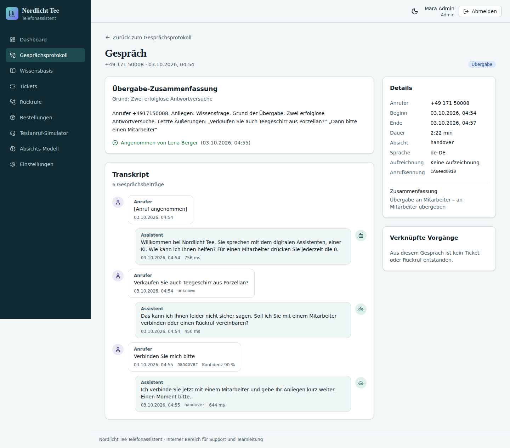
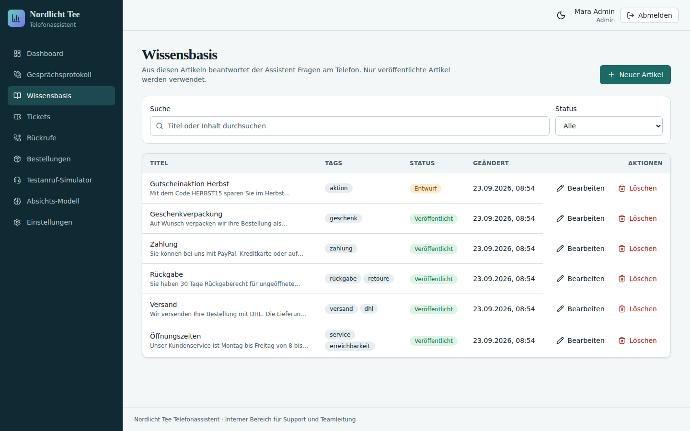
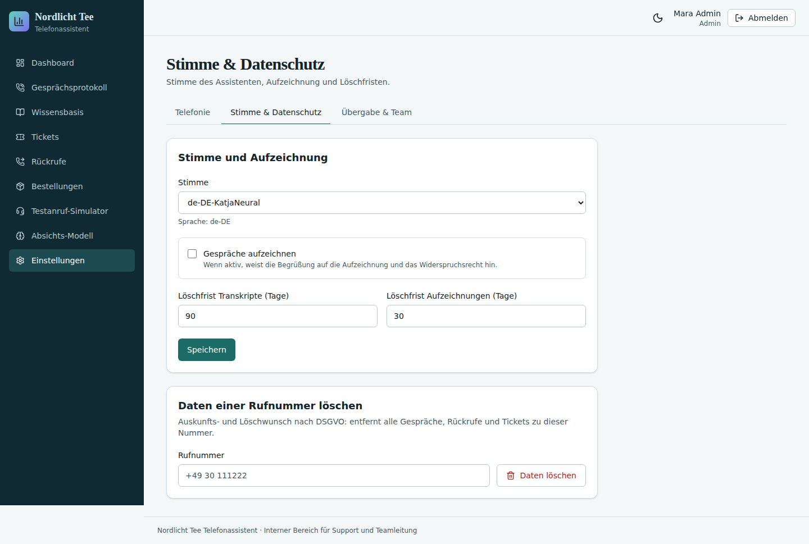
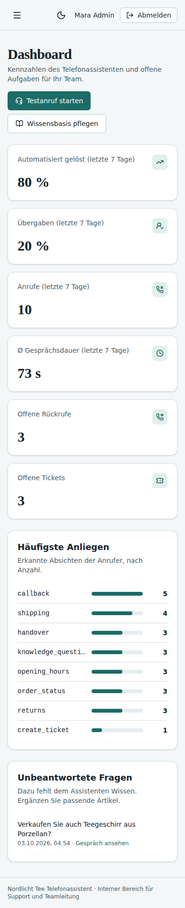

# Showcase: Telefon-KI-Assistent für „Nordlicht Tee“

Gebaut aus einem einzigen Prompt:

```
/onecommand:onecommand "Telefon-KI-Assistent für den Kundensupport unseres Onlineshops Nordlicht Tee, Profi-Niveau:
beantwortet Fragen zu Öffnungszeiten, Versand und Rückgabe aus unserer Wissensbasis, gibt den Bestellstatus durch,
legt Tickets an, vereinbart Rückrufe und verbindet bei Bedarf mit einem Mitarbeiter"
```

OneCommand erkannte den Blueprint `phone-assistant` (Stufe `pro`) und baute daraus die Telefonanlage: Twilio-Webhooks
mit Signaturprüfung, eine Dialog-Engine, eine Wissensbasis, Aktionen (Bestellstatus, Ticket, Rückruf), die Übergabe
an Mitarbeiter, ein Gesprächsprotokoll mit maskierten Daten, Auswertungen und eine Verwaltungsoberfläche für drei
Rollen.

| | |
|---|---|
| Stack | Next.js 16, React 19, Prisma, SQLite, Tailwind; Twilio, Deepgram, Azure Neural TTS (im Test durch Fakes ersetzt) |
| Abnahme | 61 Kriterien, 60/60 automatische Abnahmetests grün, 11/11 Testanrufe grün, 54 Screenshots im Rundgang |
| Antwortzeit | unter 50 ms pro Gesprächszug in der Dialog-Engine |

Die Bilder zeigen die Produktionsversion mit Demo-Daten, angemeldet als `admin@nordlicht-tee.demo`. Sie wurden
nicht nachbearbeitet. Gebaut wurde mit v1.10.0.

## Testanruf-Simulator: dieselbe Dialog-Engine wie bei echten Anrufen


## Dashboard


## Gespräch mit Übergabe an eine Mitarbeiterin


## Wissensbasis: aus diesen Artikeln antwortet der Assistent


## Stimme und Datenschutz: Aufzeichnung nur mit Hinweis, Löschfristen, Löschung pro Rufnummer


## Mobil


## Was die Prüfungen von v1.11.0 an diesem Build finden

Der Build bestand alle Prüfungen von v1.10.0. Die neuen Prüfungen von v1.11.0 finden daran trotzdem Fehler. Für die
Testanrufe sind das genau die Fälle, die ein echter Test mit Anrufersätzen gezeigt hat:

| Pflicht-Testanruf / Prüfung | Antwort dieses Builds | Ergebnis |
|---|---|---|
| Small Talk: „Ja, hallo“ | „Das habe ich leider nicht verstanden. Ich verbinde Sie mit einem Mitarbeiter …“ | ✗ |
| Beschwerde: „Schon wieder falsch geliefert!“ | „Wie bitte? Das habe ich leider nicht verstanden.“ | ✗ |
| Folgefrage nach Bestellung 4711: „Wann kommt es denn genau?“ | „Wie lautet Ihre Bestellnummer?“ | ✗ |
| Bekannte Nummer: „Ändern Sie bitte die Lieferadresse“ | gibt den Bestellstatus durch, keine Prüfung | ✗ |
| Taste 0 (Übergabe) | spricht über TwiML `<Say>`, also mit Twilios Roboterstimme | ✗ |
| Rundgang: Dashboard und Gesprächsprotokoll | zeigen `order_status` und `knowledge_question` statt deutscher Namen | ⚠ |

Ab v1.11.0 lässt jeder dieser Fehler den Build durchfallen oder wird beim Durchsehen der Screenshots gemeldet. Die
Regeln dafür stehen im Skill `voice-agent`.

---
Gebaut mit OneCommand · USC Software UG
